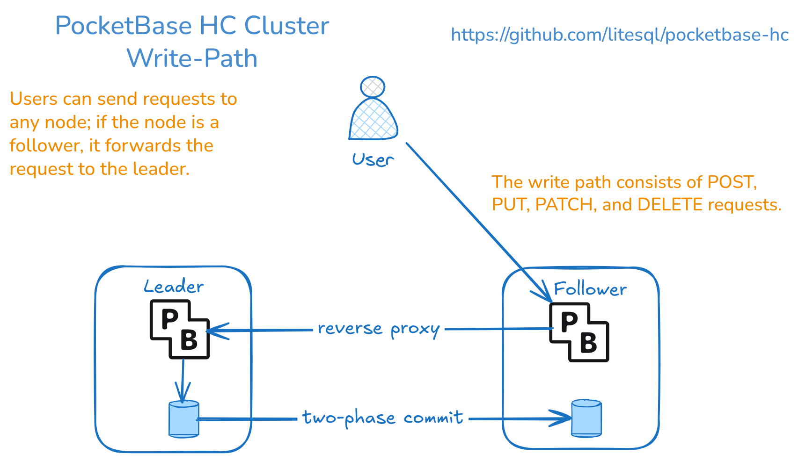

# PocketBase HC
Highly Consistent [PocketBase](https://pocketbase.io/) Cluster powered by `go-ha` [database/sql driver](https://github.com/litesql/go-ha).

## Features

- **High Consistency**: Run multiple PocketBase instances with transactional consistency.
- **Replication**: Synchronize data across nodes via gRPC.
- **Remote direct access to Database**: via a secured gRPC endpoint for direct database access from remote clients. Use [terminal](#remote-database-access-from-terminal) or [DBeaver](https://github.com/litesql/jdbc-ha#dbeaver-integration).
- **Undo transactions**: Use `pocketbase-hc cli` (or any gRPC client) to execute [UNDO](#undo-transactions) commands on already commited transactions. 

## Prerequisites

- **Go**: Version `1.27` or later is required.

## Installation

Download from [releases page](https://github.com/litesql/pocketbase-hc/releases/latest/).

### Install from source

Install the latest version of `pocketbase-hc` using:

```sh
go install github.com/litesql/pocketbase-hc@latest
```

### Docker image

```sh
docker pull ghcr.io/litesql/pocketbase-hc:latest
```

## Configuration

Set up your environment variables to configure the cluster:

| Environment Variable | Description                                                                 | Default |
|----------------------|-----------------------------------------------------------------------------|---------|
| `PB_2PC_TIMEOUT`       | Two-phase commit timeout.             | 10s        |
| `PB_GRPC_PORT`       | TCP Port for the gRPC service to enable remote database access.             |         |
| `PB_GRPC_TOKEN`      | Authentication token for securing remote database access via gRPC.          |         |
| `PB_NAME`            | A unique name for the node. Defaults to the system's hostname if not provided. | $HOSTNAME |
| `PB_PEERS`           | Comma-separated list of peers to replicate data to                          |         |
| `PB_ROW_IDENTIFY`    | Strategy used to identify rows during replication. Options: `pk`, `rowid` or `full`. | pk |
| `PB_STATIC_LEADER`   | URL target to redirect all writer requests to the cluster leader            |         |
| `PB_SUPERUSER_EMAIL` | Superuser email created at startup                                          |         |
| `PB_SUPERUSER_PASS`  | Superuser password created at startup                                       |         |


## Usage

### Starting a Cluster

1. Start the first PocketBase HA instance:

    ```sh
    PB_NAME=peer1 PB_STATIC_LEADER=http://localhost:8090 PB_GRPC_PORT=9091 pocketbase-hc serve --http 127.0.0.1:8091
    ```

2. Start a leader instance in a different directory:

    ```sh
    PB_NAME=leader PB_PEERS=http://localhost:9091 pocketbase-hc serve
    ```

> **Note**: You can skip setting the superuser password for the peer1 instance.

### Running a Cluster with docker

To run a pocketbase-hc cluster using Docker Compose, use the following command:

```sh
docker compose up
```

- Superuser e-mail: test@example.com
- Superuser pass: 1234567890

You can define the superuser password using this command:

```sh
docker compose exec node1 /app/pocketbase-hc superuser upsert EMAIL PASS
```

Access the three nodes using the following address:

- Node1: http://localhost:8090
- Node2: http://localhost:8091
- Node3: http://localhost:8092

> **Tip**: Ensure all nodes are synchronized by verifying the logs or using the PocketBase admin interface.

### Event Hooks on replica nodes

On replica nodes (the nodes that users do not directly interact with), only the following events are triggered by the PocketBase event hooks system:

- OnModelAfterCreateSuccess
- OnModelAfterCreateError
- OnModelAfterUpdateSuccess
- OnModelAfterUpdateError
- OnModelAfterDeleteSuccess
- OnModelAfterDeleteError

### Data Replication

**PocketBase HC** uses a two-phase commit strategy for handling transactions.

For applications that require higher availability, consider using [PocketBase HA](https://github.com/litesql/pocketbase-ha).

### Configuring a Cluster Leader

Set `PB_STATIC_LEADER` environment variables to designate a leader node that processes all write requests:

#### Static Leader

```sh
export PB_STATIC_LEADER=http://leader-addr:8090
```

This ensures all mutations route through the leader while reads can be distributed across replica nodes.



### Remote database access from terminal

To enable remote access, set `PB_GRPC_PORT` before starting the service:

```sh
export PB_GRPC_PORT=9090
pocketbase-hc serve
```

Then, from another terminal, connect with:

```sh
pocketbase-hc remote http://localhost:9090
```

Then execute any SQL command:

```sh
data.db> SELECT * FROM PRAGMA_table_list;
```

#### Protect the connection with a token

Set `PB_GRPC_TOKEN` to require authentication for remote gRPC access.

```sh
export PB_GRPC_PORT=9090
export PB_GRPC_TOKEN=secret
pocketbase-hc serve
```

Then, from another terminal, connect with:

```sh
pocketbase-hc remote http://localhost:9090 --token secret
```

#### Undo transactions

You can undo transactions using `pocketbase-hc cli` UNDO command:

```sh
# connect
pocketbase-hc remote http://host:port

# undo latest transaction
undo;

# undo last N transactions
undo N;

# undo transactions since time. Ex: undo 5m; (5 minutes ago)
undo <time duration>;

# show the latest transaction
history;

# show the last N transactions
history N;

# show the transactions since time.
history <time duration>;
```

## Contributing

Contributions are welcome! Feel free to open issues or submit pull requests to improve this project.


## License

This project is licensed under the [MIT License](LICENSE).

